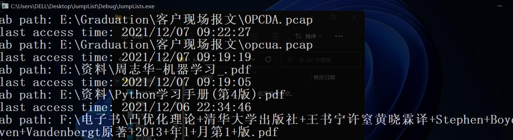

# Jumplists

`Windows`右键固定栏的应用程序时，会出现最近使用的项目，便于用户快速访问。这是`Windows`自动保存的信息，在电子取证时，可以作为相关的证据支撑。

`JumpList`文件符合一种[`OLE-CF`](https://github.com/libyal/libolecf/blob/main/documentation/OLE%20Compound%20File%20format.asciidoc)结构，即`Object Linking and Embedding(OLE) Compound File(CF)`。`Windows`中很多文件都符合这种结构，例如`ppt`，`word`，`excel`。

## FileHeader

前`512`字节是文件头，文件头记录一些基本信息。

| 偏移量 |   大小    |                        描述                        |
| :----: | :-------: | :------------------------------------------------: |
|  `0`   |    `8`    | 文件幻术，通常为`\xd0\xcf\x11\xe0\xa1\xb1\x1a\xe1` |
|  `8`   |   `16`    |      `Class identifier (GUID)`，一般全部为`0`      |
|  `24`  |    `2`    |                      子版本号                      |
|  `26`  |    `2`    |                      主版本号                      |
|  `28`  |    `2`    |       字节序，`\xff\xfe`大端；`\xfe\xff`小端       |
|  `30`  |    `2`    |                 扇区(`sector`)大小                 |
|  `32`  |    `2`    |             小扇区(`mimi-sector`)大小              |
|  `34`  |    `2`    |                 `Reserved`保留字段                 |
|  `36`  |    `4`    |                 `Reserved`保留字段                 |
|  `40`  |    `4`    |                 `Reserved`保留字段                 |
|  `44`  |    `4`    |                用于`SAT`的扇区数量                 |
|  `48`  |    `4`    |              目录的起始扇区号(`SID`)               |
|  `52`  |    `4`    |                 `Reserved`保留字段                 |
|  `56`  |    `4`    |             标准流的大小(通常是`4096`)             |
|  `60`  |    `4`    |            `SSAT`的起始扇区号（`SID`）             |
|  `64`  |    `4`    |                用于`SSAT`的扇区数量                |
|  `68`  |    `4`    |            第一个`MSAT`的扇区号(`SID`)             |
|  `72`  |    `4`    |                  `MSAT`的扇区数量                  |
|  `76`  | `109 * 4` |            `MSAT`表，包含了`109`个`SID`            |

文件头占据`512`字节，之后每`512`字节便是一个`sector`，编号从`0`开始。这个编号也称为扇区标识符`SID`。

## 扇区与SID

`SID`有一些特殊的值。

|  `SID (Name)`   |        `Meaning`         |
| :-------------: | :----------------------: |
| `-1` `Free SID` |      空闲的`sector`      |
|   `-2` `End`    |     `SID`链结束标记      |
| `-3` `SAT SID`  | 此`sector`用于存放`SAT`  |
| `-4` `MSAT SID` | 此`sector`用于存放`MSAT` |

根据`SAT`存储的`SID`，可以构建多条`SAT`链，这些流就存储在这些链中。从目录中能够找到`DestList`开始的位置，之后按照`DestList`的格式解析即可。

## DestList

最近访问的文件信息存储在`DestLists`目录下。在`Windows10`和`Windows 7`中，`DestLists`文件结构略有[差异](https://www.forensicfocus.com/forums/general/windows-10-and-jump-lists/#post-6576701)，代码以`Windows 10/11`为例。

按照`Destlist`结构解析，便能获取访问文件的绝对路径(`ab path`)和最近一次访问时间(`LastAccessTime`)等重要信息。

## demo

程序运行结果见示意图。

## Ref

* https://github.com/libyal/libolecf/blob/main/documentation/OLE%20Compound%20File%20format.asciidoc